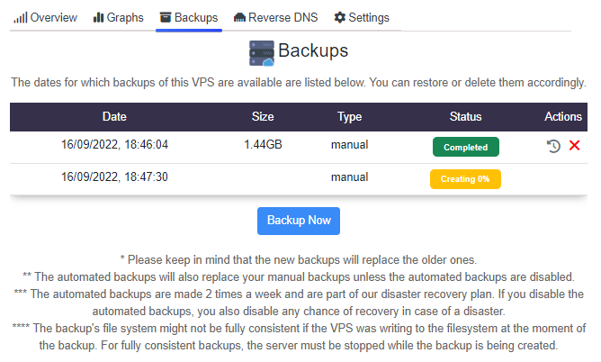

# WHMCS Server Provisioning - [MVPS](https://www.mvps.net/)
Below you'll find out how can you install and configure this WHMCS Server Module. If you have any question or problem, I will be at your disposal to configure it remotely.

## Description
Start selling MVPS services with this module!

# Screenshots

.png)

# Documentation
Please check here: [https://docs.andrezzz.pt/whmcs/servers/mvps](https://docs.andrezzz.pt/whmcs/servers/mvps)

# Contact information
[Website](https://www.andrezzz.pt) 
[Discord](https://www.andrezzz.pt/discord) 

# Copyright
Copyright (c) 2022 André Antunes (Andrezzz). All rights reserved. You can't sell this WHMCS Server Module as your authorship.
